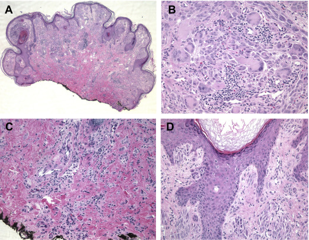
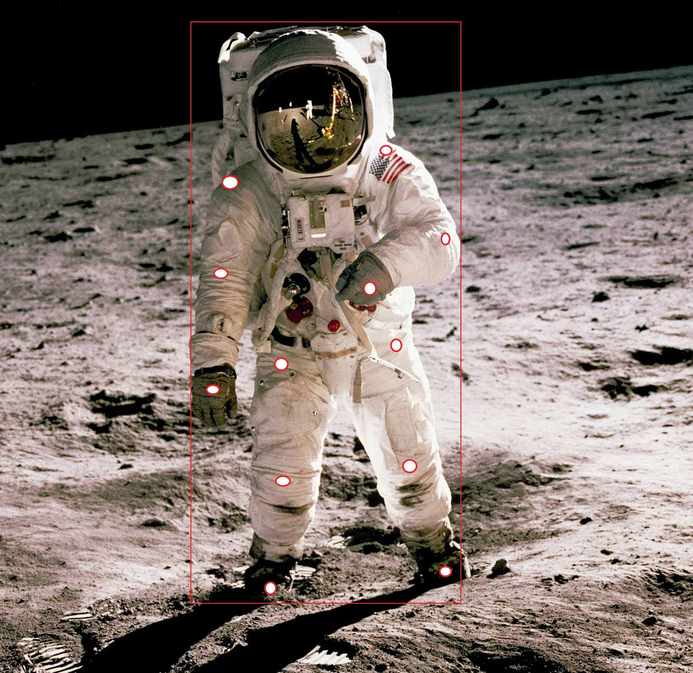

# Data Science Portfolio - Raphael Kiminya

## Projects

 **[VisioMel Challenge: Predicting Melanoma Relapse](https://github.com/kiminya-raphael/visiomel-melanoma)**

The goal was to develop a robust algorithm for predicting melanoma recurrence using digitized pathology slides and clinical data. First, I trained a model to identify key relapse prognostic factors - Breslow depth and ulceration - from Whole Slide Images. I then integrated these factors with patient metadata to train the final replapse prediction model.

#

 **[NASA Spacesuit Detection Challenge](https://www.topcoder.com/challenges/116fc3d9-a4e0-4a93-8ef1-a075ae16ee88?tab=details)**

I developed an object and keypoint detection model to analyze spacesuit movements during spacewalks, enabling accurate posture extraction without the need for motion capture cameras.

