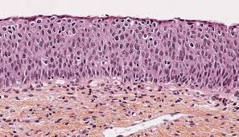
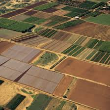
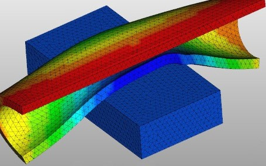
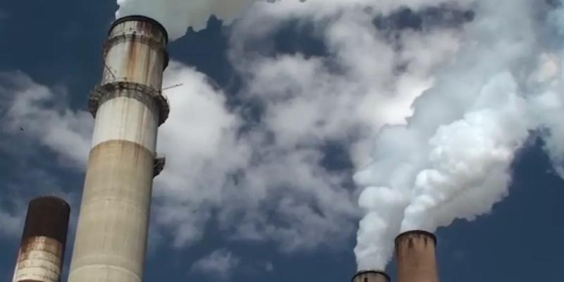
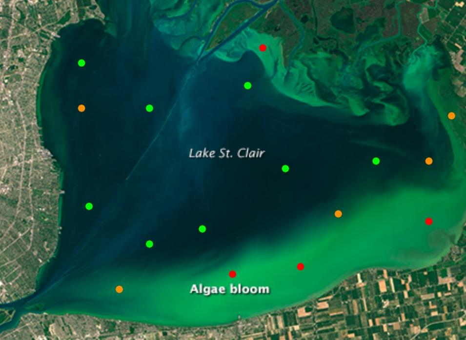
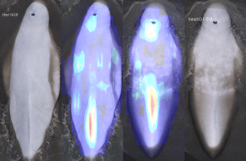
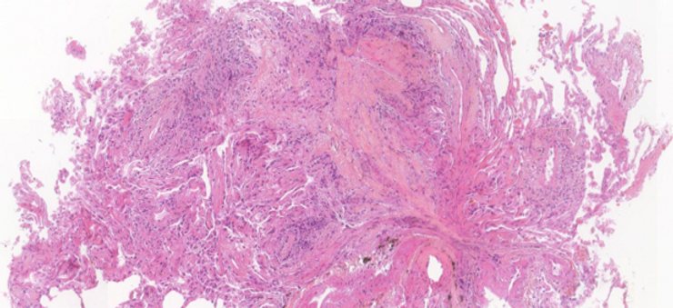

# Data Science Portfolio - Raphael Kiminya

## Projects

 **[VisioMel Challenge (French Society of Pathology)](https://drivendata.co/blog/visiomel-melanoma-winners)**

The goal was to develop a robust algorithm for predicting melanoma recurrence using digitized pathology slides and clinical data. First, I trained a model to identify key relapse prognostic factors - Breslow depth and ulceration - from Whole Slide Images. I then integrated these factors with patient metadata to train the final replapse prediction model.

---

 **[TissueNet: Detect Lesions in Cervical Biopsies (French Society of Pathology)](https://drivendata.co/blog/tissuenet-cervical-biopsies-winners/)**

A model to detect and classify cervical epithelial lesions from whole slide images, ranking them by severity from benign to low malignant potential, high malignant potential, and invasive cancer. The dataset comprised thousands of WSIs from medical centers across France. This model enhances tumor subtype classification and could serve as a diagnostic aid for pathologists, improving cervical cancer detection and treatment decisions.

---

 **[Spot the Crop Challenge (Radiant Earth Foundation)](https://medium.com/radiant-earth-insights/data-challenge-winner-q-a-with-raphael-kiminya-bda56c54fe3e)**

Developed a remote sensing time series model to classify crops in the Western Cape of South Africa using Sentinel-2 satellite multi-spectral multi-temporal images.
 
 
 

---

 **[High-Energy Particle Classification](https://github.com/kiminya-raphael/High-Energy-Particle-Classification-with-Graph-Neural-Networks)**

The goal was to categorize jets in high-energy proton-proton collision events. I represented jets as particle clouds and used Graph Neural Networks to capture their internal structure based on energy, momentum, and decay patterns.
 
 

---

 **[Plastic mold deformation analysis (Asahi Kasei Corporation)](https://www.topcoder.com/challenges/499caa95-89e6-4813-a2fa-891ad378f76a?tab=details)**

Model to predict shape deformation and internal stress of molded products. Traditional techniques for simulating deformation behavior of plastics are computationally expensive and require repetitive tuning. This solution leverages machine learning as a proxy model for faster, efficient and reproducible predictions. Given a hollow rectangular box with varying wall thickness and holes, the model estimates displacement and maximum stress at each node when subjected to external pressure.

---

 **[Air quality prediction (NASA)](https://drivendata.co/blog/nasa-airathon-winners)**

The goal was to forecast air pollutant levels in urban areas. I extracted and integrated datasets from multiple satellites and forecast repositories and developed a model that can generate daily estimates of surface-level Nitrogen Oxide (NO2) and particulate matter 2.5 (PM2.5).
 
 

---

 **[Soundscapes Challenge (National Geospatial-Intelligence Agency)](https://www.soundscapeschallenge.com)**

Developed an audio classifier to geo-locate non-speech ambient sound recordings from 9 major cities. The model will improve the ability to determine the origin of audio recordings on Earth.
 
 
 

---

 **[Harmful Algal Bloom Detection (NASA)](https://drivendata.co/blog/tick-tick-bloom-challenge-winners)**

Developed a model to identify areas at risk of harmful algal blooms in lakes, reservoirs, rivers, and other inland water bodies using Landsat and Sentinel-2 satellite imagery to measure cyanobacteria concentrations.
The solution is deployed in the [CyFi: Cyanobacteria Finder package](https://cyfi.drivendata.org/)
 
 

---

 **[Spacesuit Detection Challenge (NASA)](https://www.topcoder.com/challenges/116fc3d9-a4e0-4a93-8ef1-a075ae16ee88?tab=details)**

Developed an object and keypoint detection model to analyze spacesuit movements during spacewalks. The model enables accurate posture extraction without the need for motion capture cameras.
 
 
 

---

 **[Beluga Whale Identification (Bureau of Ocean Energy Management)](https://drivendata.co/blog/belugas-winners)**

An individual identification model to track Cook Inlet belugas, an endangered population of beluga whales. The model enables conservationists to identify and monitor individual whales using images captured by drones and vessels. Wildlife researchers can leverage this technology to estimate population size and assess health. This method is less invasive, costly, and labor-intensive compared to traditional techniques like physically tagging animals.

---

 **[DigiLut Challenge (Foch Hospital)](https://github.com/kiminya-raphael/Digilut-Challenge)**

Developed a model to detect lung graft rejection in transbronchial biopsies. The model could serve as a medical decision support tool to diagnose transplant failures thereby improving outcomes for lung transplant recipients.
 
 

---

